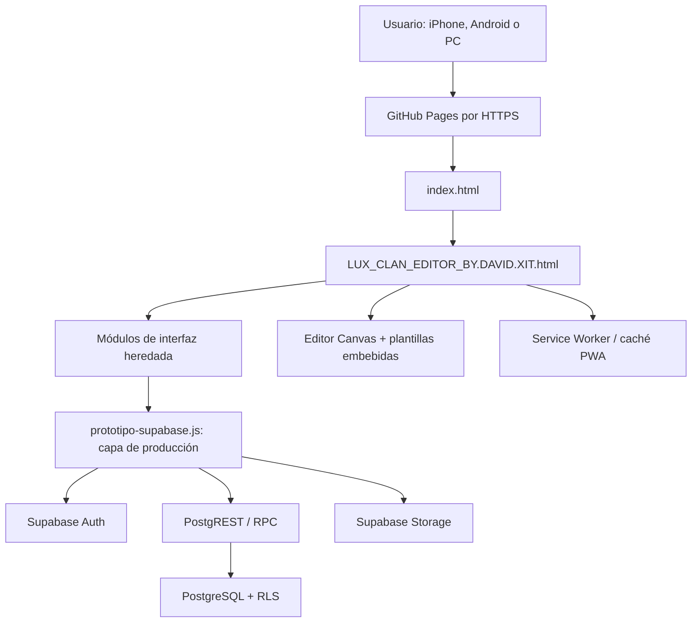

# LUX CLAN SERVER — guía técnica completa para mantenimiento por IA

> Documento de traspaso técnico y reglas de seguridad. Su objetivo es que otra IA o persona pueda entender, probar y modificar el proyecto sin romper los perfiles, la autenticación, los permisos, los banners, el ranking ni la experiencia móvil.

## 0. Estado de este documento

- Proyecto: **LUX CLAN SERVER**.
- Repositorio: `David32094/lux-clan-server`.
- Rama de producción: `main`.
- Sitio público: <https://david32094.github.io/lux-clan-server/>.
- Documento verificado contra el código local el **8 de agosto de 2026**.
- HTML de producción actual: `LUX_CLAN_EDITOR_BY.DAVID.XIT.html`.
- Backend: Supabase Auth + PostgreSQL + Storage + Row Level Security (RLS).
- Hosting: GitHub Pages mediante GitHub Actions.
- Plataformas objetivo: Chrome/Android, Safari/iPhone y navegadores de escritorio.

Este documento describe el estado real del repositorio en la fecha indicada. Antes de cambiar algo, una IA debe volver a comprobar `git status`, el último commit, las migraciones y los nombres de archivos. Si el código y este documento difieren, el código y la base de datos desplegada son la fuente de verdad; después debe actualizarse esta guía.

### Índice rápido

- [Propósito y contratos](#1-propósito-del-producto)
- [Arquitectura](#3-arquitectura-general)
- [Archivos del repositorio](#4-árbol-del-repositorio-y-responsabilidad-de-cada-archivo)
- [Orden de carga](#5-orden-de-carga-obligatorio)
- [Navegación y roles](#6-modelo-de-navegación-y-lo-que-ve-cada-persona)
- [Autenticación](#8-autenticación-y-persistencia-de-sesión)
- [Base de datos y Storage](#9-modelo-de-datos-de-supabase)
- [Victorias y anti-duplicado](#13-flujo-de-victorias-y-protección-contra-fraude-básico)
- [Editor de banners](#15-editor-de-banners)
- [PWA/offline](#17-pwa-y-funcionamiento-offline)
- [Despliegue](#18-despliegue-en-github-pages)
- [Pruebas obligatorias](#22-lista-de-pruebas-obligatorias-antes-de-decir-terminado)
- [Problemas conocidos](#24-problemas-conocidos-y-deuda-técnica)
- [Acciones prohibidas](#26-acciones-prohibidas-para-una-ia-sin-autorización-explícita)
- [Procedimiento para otra IA](#27-procedimiento-recomendado-para-otra-ia)

---

## 1. Propósito del producto

LUX CLAN SERVER es una web/PWA para administrar un clan de videojuegos. Reúne en un solo sitio:

1. Registro e inicio de sesión de integrantes mediante Google/Supabase Auth.
2. Perfil de cada integrante con nombre, edad, país y foto.
3. Generación automática de un banner oficial a partir del perfil.
4. Envío de capturas de victorias en modalidades `1v1`, `2v2`, `3v3`, `4v4` y `Otro`.
5. Moderación de esas victorias antes de que sumen al ranking.
6. Ranking público basado únicamente en victorias aprobadas.
7. Perfiles públicos con estadísticas y capturas aprobadas ampliables.
8. Directorio de integrantes para miembros autenticados y administradores.
9. Panel administrativo para moderar, descargar banners, gestionar integrantes y placas.
10. Gestión privada de cuentas y roles para la cuenta `owner`.
11. Editor Canvas para banners de integrantes y enfrentamientos.
12. Instalación como PWA y uso parcial sin conexión después de la primera carga.

### Principio central

La web no debe confiar en el navegador para proteger datos ni conceder permisos. La interfaz puede ocultar botones, pero la autorización real debe seguir estando en PostgreSQL mediante RLS y funciones `security definer` que comprueban `auth.uid()` y el rol guardado en `public.user_roles`.

---

## 2. Comportamientos que no se pueden romper

Estos son contratos funcionales del producto, no simples preferencias visuales:

- Un usuario nuevo siempre empieza con rol `member`.
- El rol nunca se toma de parámetros de URL, `localStorage`, metadatos de Google ni campos editables del perfil.
- Solo una cuenta `owner` puede nombrar o quitar `leader` y `moderator`.
- Una líder solo puede expulsar cuentas con rol `member`; no puede expulsar personal administrativo ni borrarse a sí misma.
- La cuenta `owner` no puede cambiar su propio rol ni eliminarse desde la web.
- Los correos y datos de Auth solo aparecen en el apartado privado **Cuentas** del `owner`.
- Una victoria enviada empieza en estado `pending` y no suma al ranking hasta ser `approved`.
- Una misma captura no puede registrarse de nuevo aunque se cambie el nombre del archivo.
- Un integrante no puede enviar más de ocho victorias pendientes en una ventana de 24 horas.
- Las capturas `pending` o `rejected` no son públicas.
- Las capturas `approved` de perfiles públicos sí se pueden ver y ampliar desde los perfiles.
- El banner oficial se genera siempre desde la plantilla y los datos actuales del perfil. No depende de que el usuario haya descargado o guardado antes un PNG.
- La foto de perfil debe ser la misma en ranking, directorio, perfil público, perfil administrativo y placas.
- El editor debe seguir funcionando en iPhone y Android después de una primera carga HTTPS.
- En móvil, desplazar la página no debe arrastrar accidentalmente objetos del Canvas; editar requiere mantener pulsado antes de arrastrar.
- La navegación principal debe seguir visible o reproducirse al entrar a Ranking y Banners, para evitar pantallas sin salida.
- El editor de integrantes y el de enfrentamientos usan Canvas de `941 × 1672`; cambiar esa resolución exige recalcular todas las coordenadas y presets.

---

## 3. Arquitectura general



### Decisión arquitectónica importante

Los archivos llamados `prototipo-*.js` no son todos código desechable. Algunos nacieron como demo local, pero actualmente crean gran parte del DOM, estilos, IDs y APIs globales que la capa Supabase reutiliza y sobrescribe. Borrarlos sin reescribir esas dependencias deja la web en blanco o rompe botones.

El flujo es:

1. Los módulos heredados inyectan pantallas y exponen objetos como `window.luxHub`.
2. `supabase-client-config.js` define o deja disponible `window.LUX_SUPABASE_CONFIG`.
3. `prototipo-supabase.js` se carga al final, valida la configuración y reemplaza los métodos de demo por operaciones reales y seguras.
4. Si no hay configuración Supabase, el guard de producción termina temprano y permanece la demo local. Ese modo no representa producción y no debe usarse para validar seguridad.

---

## 4. Árbol del repositorio y responsabilidad de cada archivo

### Entradas y aplicación principal

| Archivo | Responsabilidad | Regla de mantenimiento |
|---|---|---|
| `index.html` | Entrada corta de GitHub Pages. Registra el Service Worker y redirige al HTML principal conservando query y hash. | Mantener la redirección, la URL canónica y la espera limitada del Service Worker. |
| `LUX_CLAN_EDITOR_BY.DAVID.XIT.html` | Aplicación de producción, editor Canvas, plantillas base64, formularios, presets y carga de módulos externos. | Es el archivo que se publica y prueba. Tiene unos 5,5 MB por las imágenes embebidas. No hacer reemplazos globales ciegos. |
| `LUX_CLAN_EDITOR.html` | Fuente/versión histórica del editor antes de varias integraciones. | No asumir que es producción. Herramientas antiguas aún lo leen. Comparar antes de usarlo como fuente. |
| `ABRIR-EDITOR.bat` | Servidor local en puerto `8091` y apertura del editor. | Mata el proceso que ya esté usando 8091; no ejecutarlo si hay otro servicio importante en ese puerto. |

### Interfaz y lógica del navegador

| Archivo | Responsabilidad actual | Dependencias críticas |
|---|---|---|
| `prototipo-lider.js` | Panel/datos locales heredados, modo integrante/líder y elementos estructurales. | `prototipo-clan-hub.js` y la capa de producción esperan `window.luxLeaderDemo`. |
| `prototipo-clan-hub.js` | Inyecta Inicio, Mi cuenta, Admin, modales, formularios, IDs y la API base `window.luxHub`. Incluye fallback local. | Muchos IDs se consultan después desde `prototipo-supabase.js`. |
| `prototipo-accesos.js` | Inyecta login base, pantalla pública de ranking y API base `window.luxAccess`. | Su `setScreen` envuelve al del hub; la capa Supabase conserva la referencia base. |
| `prototipo-placas.js` | Inyecta panel, modal y estilos de placas; ofrece fallback local. | Supabase reemplaza las operaciones de datos, pero conserva el DOM y algunos métodos. |
| `prototipo-supabase.js` | Capa de producción: Auth, sesión, REST/RPC, Storage, roles, navegación, perfiles, victorias, ranking, cuentas, borrado, placas y enlace con el editor. | Debe cargarse el último. Depende de IDs y namespaces creados antes. |
| `lux-simple-ui.css` | Sobrescrituras visuales modernas y responsive para las pantallas de integrante/admin/ranking/editor. | Cambios aquí pueden requerir subir el parámetro `?v=` en el HTML y el caché del Service Worker. |
| `mobile-touch-fix.js` | Gestos del editor móvil: diferencia scroll de edición mediante pulsación prolongada. | Mantener `touch-action`, umbrales y listeners no pasivos donde corresponda. |

### PWA, configuración y despliegue

| Archivo | Responsabilidad | Observaciones |
|---|---|---|
| `manifest.webmanifest` | Nombre, icono, `start_url`, `scope`, orientación y modo standalone. | `start_url` apunta a `./index.html?app=1`. |
| `sw.js` | Caché offline del shell y estrategia de actualización. | Caché actual: `lux-clan-editor-offline-v43`. Debe incrementarse al publicar cambios relevantes. |
| `supabase-client-config.js` | Placeholder público local para `window.LUX_SUPABASE_CONFIG`. | En GitHub Pages el workflow lo reemplaza por URL + publishable key. Nunca colocar `service_role`. |
| `supabase/client-config.example.js` | Ejemplo de estructura de configuración. | No es el archivo leído directamente por producción. |
| `.github/workflows/deploy-pages.yml` | Valida JS/secretos, genera la configuración y publica todo en GitHub Pages. | Usa variable `SUPABASE_URL` y secret `SUPABASE_PUBLISHABLE_KEY`. |
| `.gitignore` | Ignora entorno, dependencias y temporales. | La publishable key puede llegar al cliente; la clave privada nunca. |

### Base de datos

| Ruta | Responsabilidad |
|---|---|
| `supabase/migrations/20260807_secure_clan.sql` | Esquema base, enums, tablas, triggers, RLS, RPC iniciales y buckets. |
| `supabase/migrations/20260808_authenticated_clan_directory.sql` | Directorio del clan para usuarios autenticados. |
| `supabase/migrations/20260808_clan_management_v2.sql` | Banners privados, modos adicionales, roles del personal, borrado y ranking ampliado. |
| `supabase/migrations/20260808_owner_accounts.sql` | Listado privado de cuentas Auth para owner. |
| `supabase/migrations/20260808_owner_role_management.sql` | Cambio seguro de roles por owner. |
| `supabase/migrations/20260808_public_approved_victory_gallery.sql` | Ranking/perfiles públicos y lectura exclusiva de evidencias aprobadas. |
| `supabase/migrations/20260808_public_plate_avatars.sql` | Avatar en el ranking de placas. |
| `supabase/migrations/20260808_refresh_victory_validation.sql` | Reparación idempotente de `can_submit_victory` y recarga de PostgREST. |

Las migraciones se aplican en orden de nombre. Las posteriores reemplazan funciones de las anteriores; no se puede entender el esquema mirando solo el primer SQL.

### Recursos y herramientas auxiliares

| Ruta/archivo | Uso |
|---|---|
| `BANDERAS/` | 543 SVG de banderas en variantes `1x1` y `4x3`. El editor también puede cargar banderas por código mediante URL/datos SVG. |
| `INTEGRANTES/base.png` | Plantilla visual de integrante. Una copia está embebida en el HTML de producción. |
| `ENFRETAMIENTOS/base.png` | Plantilla visual de enfrentamientos. |
| `ENFRETAMIENTOS/OVERLAY POR ENCIMA DE LA FOTO DEL RESULTADO.png` | Overlay de la captura de resultados. |
| `FONDO/`, `ICONOS/`, `RECLUTAMIENTO/` | Recursos gráficos del sitio y PWA. |
| `configuraciones/*.json` | Presets exportados de integrantes/enfrentamientos. |
| `inyectar_configs.py` | Herramienta histórica que genera `LUX_CLAN_EDITOR_CON_CONFIGS.html` desde `LUX_CLAN_EDITOR.html`. Está desactualizada respecto al flujo PWA actual. No ejecutarla para publicar sin revisarla. |
| `find_exact_align.py` | Búsqueda experimental de alineación de overlay usando Pillow y el HTML antiguo. Puede generar `best_overlay_match.png`. No forma parte del runtime. |
| `plantilla.png` | Recurso histórico/auxiliar; verificar referencias antes de eliminar. |

---

## 5. Orden de carga obligatorio

Al final del HTML de producción se cargan exactamente así:

1. `prototipo-lider.js?v=20`
2. `prototipo-clan-hub.js?v=20`
3. `prototipo-accesos.js?v=23`
4. `prototipo-placas.js?v=20`
5. `supabase-client-config.js?v=20`
6. `prototipo-supabase.js?v=40`

`lux-simple-ui.css?v=7` se carga como hoja externa.

No cambiar el orden sin mapear las APIs globales y el DOM que produce cada archivo. En particular:

- `prototipo-clan-hub.js` crea `window.luxHub` y elementos como `hub-member`, `hub-admin`, `hub-modal`, formularios de perfil y controles de victorias.
- `prototipo-accesos.js` crea `lux-public-screen` y `window.luxAccess`.
- `prototipo-placas.js` crea `lux-plates-panel`, `lux-plates-modal` y `window.luxPlates`.
- `prototipo-supabase.js` extiende/sobrescribe esos objetos y reconfigura los `onclick`.

Si se desea eliminar los módulos heredados, debe hacerse como una refactorización completa: mover primero todo su HTML, estilos y contratos a componentes nuevos, ajustar cada selector en Supabase y probar todas las rutas. No es seguro borrarlos uno a uno.

---

## 6. Modelo de navegación y lo que ve cada persona

### 6.1 Visitante sin sesión

Ve la portada del clan. Las consultas de ranking y perfiles aprobados están diseñadas para ser públicas y no exigen un JWT. Cuando la navegación ofrece la entrada a clasificación, puede:

- abrir la clasificación pública;
- ver perfiles públicos;
- ver edad, país, avatar y estadísticas públicas;
- abrir capturas de victorias aprobadas;
- iniciar sesión con Google.

No puede:

- completar un perfil;
- subir victorias;
- ver capturas pendientes/rechazadas;
- entrar a administración;
- conocer correos o roles internos no públicos.

### 6.2 Integrante (`member`)

La cuenta tiene pestañas principales:

1. **Inicio**: acciones simples y explicación en tres pasos.
2. **Ranking**: clasificación y perfiles del resto del clan.
3. **Mi perfil**: nombre, edad, país, avatar y descarga del banner.
4. **Subir victoria**: modo, captura, envío e historial propio.
5. **Integrantes**: directorio de perfiles y estadísticas.

Puede ver perfiles de otros integrantes y sus capturas aprobadas. No puede cambiar roles ni aprobarse sus propias capturas.

### 6.3 Moderador/a (`moderator`)

Además de su cuenta de integrante, accede a administración. Ve:

- Inicio del panel;
- Ranking;
- Victorias pendientes;
- Integrantes;
- Banners.

No ve **Cuentas** y no administra placas en la configuración actual. La autorización de revisión usa `is_clan_staff`, que incluye owner, leader y moderator.

### 6.4 Líder (`leader`)

Ve lo mismo que moderación y también:

- Placas;
- controles para expulsar integrantes normales;
- descarga de banners de integrantes;
- gestión de imágenes de placas.

No ve correos, proveedores de autenticación ni gestión de roles del owner. No puede expulsar a otra líder, moderador u owner.

### 6.5 Propietario/a (`owner`)

Tiene todos los permisos anteriores y el apartado **Cuentas**, que permite:

- listar usuarios de Supabase Auth;
- ver correo, proveedor, fecha de creación y último acceso;
- asignar `member`, `moderator` o `leader`;
- eliminar cuentas distintas de la propia, respetando las funciones seguras del servidor;
- descargar respaldo del directorio.

El owner se identifica exclusivamente por `public.user_roles.role = 'owner'`. No se debe hardcodear un correo en JavaScript para conceder permisos.

### 6.6 Pestañas administrativas

`renderAdminTabs()` genera dinámicamente:

- `home` — Inicio;
- `ranking` — Ranking;
- `review` — Victorias, con contador de pendientes;
- `directory` — Integrantes;
- `plates` — solo owner/leader;
- `editor` — Banners;
- `accounts` — solo owner.

Ranking utiliza la pantalla pública, pero clona la cabecera/pestañas del contexto para que no desaparezca la navegación. El editor también monta una cabecera contextual en `#hub-editor-nav`.

---

## 7. Estado del cliente y APIs globales

`prototipo-supabase.js` mantiene un objeto interno `state` con:

- `session`: tokens actuales de Supabase;
- `user`: usuario Auth;
- `role`: `owner`, `leader`, `moderator` o `member`;
- `isStaff`, `isLeader`, `isOwner`: permisos derivados del rol real;
- `profile`: perfil propio;
- `pendingAvatar`: archivo seleccionado antes de subir;
- `directory`, `publicDirectory`, `publicPlates`, `ranking`, `roles`: mapas de datos;
- `editorBack`: destino al salir del editor;
- `navigationContext`: `member`, `admin` o contexto público;
- `adminSection`: pestaña administrativa activa;
- `pendingReviews`: contador de revisión.

APIs intencionalmente expuestas:

- `window.luxHub`: perfil, victoria, directorio, editor, banners, borrado y modal.
- `window.luxAccess`: login, ranking y entrada a paneles.
- `window.luxPlates`: operaciones de placas.
- `window.luxSupabase`: API de producción para handlers de UI.
- `window.luxGoogleLogin`: inicia OAuth incluso antes del guard de configuración.
- `window.downloadOfficialMemberBanner`: puente entre perfiles Supabase y Canvas.
- `window.renderInteg`, `window.readPlayerFileInteg`, `window.onFlagInteg`: integración del editor.

Los `onclick` inline dependen de esos nombres. Renombrarlos requiere modificar todos los atributos inline y los módulos que los llaman.

---

## 8. Autenticación y persistencia de sesión

### 8.1 Método recomendado

El login principal usa Google OAuth a través de Supabase:

1. El usuario pulsa **Continuar con Google**.
2. El navegador visita `${SUPABASE_URL}/auth/v1/authorize?provider=google`.
3. Google devuelve a la URL exacta del HTML con `?auth=google-v1` y tokens/código.
4. El cliente captura el hash OAuth al inicio, antes de que otros scripts cambien `location.hash`.
5. `parseOAuthCallback()` crea la sesión local.
6. `validateSession()` consulta `/auth/v1/user`.
7. `loadRole()` y `loadProfile()` hidratan la cuenta.
8. Después de OAuth, la app abre **Mi cuenta**.

### 8.2 Por qué se copia el hash

Otros módulos usan hashes como `#integrantes`. Para que no destruyan el fragmento que contiene `access_token`, el código guarda una copia temprana en `sessionStorage` bajo `lux_oauth_hash` y también acepta el respaldo histórico `lux_oauth_hash_backup`. No quitar esta protección sin migrar el flujo OAuth a PKCE/código y probar los redirects en iOS/Android.

### 8.3 Sesión persistente

- Clave: `lux_clan_auth_v1` en `localStorage`.
- La sesión incluye `access_token`, `refresh_token` y expiración.
- Si faltan menos de 45 segundos, se intenta renovar.
- Un `401` provoca un único intento de refresh y repetición de la petición.
- Si refresh y validación fallan, se borra la sesión local.
- **Salir** revoca la sesión cuando es posible y limpia el estado del cliente.

Por esto normalmente no se pide iniciar sesión cada vez. Safari puede borrar almacenamiento de sitios poco usados o en modo privado; eso no se puede evitar desde JavaScript.

### 8.4 Conservación de perfiles antiguos

La identidad principal es el UUID de `auth.users`. Cuando una cuenta de correo ya existente inicia con Google usando el mismo correo, Supabase debe enlazar/identificar la misma cuenta según su configuración de Auth. No crear perfiles paralelos manualmente en el navegador. Antes de cambiar proveedores o políticas de enlace, probar con una copia del proyecto y respaldar `auth.users`, `profiles`, `user_roles`, `victories` y Storage.

### 8.5 Configuración requerida en Supabase

- Habilitar proveedor Google.
- Configurar correctamente Client ID y secret de Google en Supabase, nunca en el repositorio.
- Añadir como Site URL/redirect permitido la URL real de GitHub Pages y, para pruebas, los orígenes locales necesarios.
- El `redirect_to` debe coincidir con el origen y pathname reales.
- Mantener HTTPS en producción. OAuth y Service Workers no funcionan de forma equivalente abriendo un `.html` desde WhatsApp/Archivos en iPhone.

---

## 9. Modelo de datos de Supabase

### 9.1 Enums

`public.clan_role`:

- `owner`
- `leader`
- `moderator`
- `member`

`public.victory_status`:

- `pending`
- `approved`
- `rejected`

### 9.2 `public.profiles`

| Columna | Significado |
|---|---|
| `id uuid` | PK y FK a `auth.users(id)` con borrado en cascada. |
| `display_name text` | Entre 2 y 24 caracteres. |
| `age smallint` | Entre 13 y 99 o `null`. |
| `country_code text` | Código de 2–3 caracteres. |
| `country_name text` | Nombre legible, máximo 60. |
| `avatar_path text` | Ruta del avatar, obligatoriamente dentro de la carpeta UUID del usuario cuando la edita el miembro. |
| `banner_path text` | Ruta del PNG privado del banner, también dentro de la carpeta UUID. |
| `is_public boolean` | Controla aparición en ranking/directorios públicos. Por defecto `true`. |
| `created_at`, `updated_at` | Auditoría básica. `updated_at` se mantiene por trigger. |

### 9.3 `public.user_roles`

| Columna | Significado |
|---|---|
| `user_id uuid` | PK/FK a Auth. |
| `role clan_role` | Rol real; nunca debe copiarse a un campo editable de `profiles`. |
| `assigned_at` | Fecha de asignación. |

El trigger `auth_user_created_profile` crea un perfil y rol `member` al registrarse un usuario. Los metadatos solo pueden sugerir el nombre; nunca elevan permisos.

### 9.4 `public.victories`

| Columna | Significado |
|---|---|
| `id uuid` | ID generado por PostgreSQL. |
| `player_id uuid` | Dueño de la victoria. |
| `mode text` | `1v1`, `2v2`, `3v3`, `4v4` u `Otro`. |
| `evidence_path text` | Debe empezar por `${player_id}/`. |
| `evidence_sha256 text` | Hash SHA-256 hexadecimal de 64 caracteres y único. |
| `status` | Empieza en `pending`. |
| `reviewed_by`, `reviewed_at` | Auditoría de moderación. |
| `rejection_reason` | Motivo opcional, máximo 300. |
| `created_at` | Fecha de envío. |

### 9.5 `public.plates`

| Columna | Significado |
|---|---|
| `id uuid` | ID de placa. |
| `player_id uuid` | Integrante al que se atribuye. |
| `title text` | 1–42 caracteres. |
| `image_path text` | Ruta de imagen en `lux-plates`. |
| `created_by uuid` | Líder/owner que la registró. |
| `created_at` | Fecha. |

---

## 10. Buckets de Storage

| Bucket | Público | Límite | MIME | Ruta esperada |
|---|---:|---:|---|---|
| `lux-avatars` | Sí | 5 MB | JPEG, PNG, WebP | `${userId}/archivo.ext` |
| `lux-evidence` | No de forma general | 8 MB | JPEG, PNG, WebP | `${userId}/uuid.ext` |
| `lux-plates` | Sí | 5 MB | JPEG, PNG, WebP | `${creatorId}/uuid.ext` |
| `lux-banners` | No | 10 MB | PNG | `${userId}/banner.png` o ruta equivalente propia |

Aunque `lux-evidence` sea privado, existe una policy de lectura para evidencias que cumplen ambas condiciones:

1. la victoria está `approved`;
2. el perfil del jugador tiene `is_public = true`.

El cliente usa URL firmada para vistas privadas de staff/propietario y acceso público controlado para capturas aprobadas. No convertir todo el bucket de evidencias en público.

Validación del cliente:

- avatar/placa: máximo 5 MB;
- evidencia: máximo 8 MB;
- banner: máximo 10 MB;
- formatos aceptados por el cliente: `image/jpeg`, `image/png`, `image/webp`, salvo banners que son PNG.

La validación del cliente mejora mensajes, pero los límites reales deben permanecer también en Storage y SQL.

---

## 11. Funciones RPC y permisos

### Lectura pública

- `get_public_ranking()` — perfiles públicos, edad, país, avatar y conteos aprobados por modo.
- `get_public_player_victories(player_id)` — solo victorias aprobadas de perfil público.
- `get_public_plate_ranking()` — ranking de placas con avatar.
- `get_public_player_plates(player_id)` — placas públicas del jugador.
- `is_public_approved_evidence(path)` — helper usado por la policy de Storage.

### Usuario autenticado

- `get_clan_directory()` — directorio seguro para integrantes autenticados.
- `can_submit_victory(sha256)` — rechaza duplicados y exceso de pendientes.

### Personal del clan

- `review_victory(id, status, reason)` — solo staff; cambia `pending` a aprobado/rechazado.
- `staff_list_member_roles()` — entrega roles a personal, no correos.
- `staff_member_assets(user_id)` — lista medios que deben borrarse con una cuenta.
- `staff_delete_member(user_id)` — owner/leader según reglas; elimina desde Auth y activa cascadas.

### Solo owner

- `is_clan_owner()` — validación del rol.
- `owner_list_clan_users()` — lista privada de Auth, correos y proveedores.
- `owner_set_member_role(user_id, role)` — acepta solo `member`, `moderator`, `leader`; no permite tocar owner ni la propia cuenta.

Todas las funciones sensibles revocan acceso general y conceden `execute` solo a `authenticated`. La función todavía debe validar el rol internamente; `authenticated` no significa autorizado.

---

## 12. Flujo de perfil y avatar

1. El usuario autenticado abre **Mi perfil**.
2. `loadProfile()` lee `profiles` por el UUID de Auth.
3. Si falta el perfil por una instalación antigua, intenta crearlo con el nombre de Google/correo.
4. El usuario edita nombre, edad, país y foto.
5. `saveProfile()` valida longitudes y país.
6. Si existe una foto nueva, se sube a `lux-avatars/${userId}/...`.
7. Se actualiza únicamente el perfil propio; RLS comprueba el UUID y la carpeta.
8. `avatarHtml()` genera la misma imagen o inicial en todas las listas.

No guardar una imagen base64 completa en `profiles`. Solo se guarda la ruta de Storage.

---

## 13. Flujo de victorias y protección contra fraude básico

### Envío

1. El usuario elige un modo permitido y una imagen.
2. El cliente valida MIME y tamaño.
3. `crypto.subtle.digest('SHA-256', bytes)` calcula el hash del contenido.
4. Se llama `can_submit_victory(hash)`.
5. Si es válido, se sube a `lux-evidence/${userId}/${uuid}.${ext}`.
6. Se inserta la fila en `victories` con estado `pending` y el SHA-256.
7. La interfaz actualiza el historial, pero el ranking no cambia.

### Controles anti-duplicado

- `unique(evidence_sha256)` es la defensa final y evita condiciones de carrera.
- `can_submit_victory` ofrece una comprobación temprana y mensaje más claro.
- Cambiar el nombre del archivo no altera el hash.
- El máximo es 8 registros `pending` del mismo usuario en las últimas 24 horas.
- Rechazar una victoria no permite volver a subir exactamente la misma captura porque el hash sigue existiendo. Si se quisiera permitir correcciones, debe diseñarse de forma explícita sin eliminar la protección global accidentalmente.

Este mecanismo detecta archivos idénticos. No detecta de forma infalible recortes, recomprensión, filtros o capturas visualmente iguales con bytes distintos. La aprobación humana sigue siendo obligatoria. Una mejora futura podría añadir hash perceptual en servidor, OCR de resultado/fecha o identificadores de partida, pero no debe sustituir el SHA-256 único.

### Moderación

1. Staff abre **Victorias**.
2. Se muestran pendientes y la imagen ampliable.
3. `review_victory` aprueba o rechaza en servidor.
4. Solo al aprobar se incorpora al ranking y al perfil público.
5. Pendientes y rechazadas continúan visibles únicamente para su dueño y staff según RLS.

### Orden del ranking

La función pública actual ordena por:

1. victorias `4v4` descendentes;
2. victorias aprobadas totales descendentes;
3. nombre ascendente.

Una versión intermedia del SQL ordenaba además `3v3`, `2v2` y `1v1`; la última migración aplicada es la autoridad. Si se cambia el criterio, hacerlo en la última función SQL y reflejarlo en todos los textos de interfaz.

---

## 14. Perfiles públicos y visor de capturas

Los perfiles públicos muestran:

- avatar centrado;
- nombre;
- país;
- edad;
- estadísticas por `1v1`, `2v2`, `3v3`, `4v4`, `Otro` y total;
- placas, si existen;
- galería de victorias aprobadas.

El visor de evidencias se crea bajo demanda con `ensureEvidenceViewer()`:

- zoom mínimo `0.5×` y máximo `4×`;
- botones `+`, `−`, restablecer y cerrar;
- rueda del ratón;
- scroll/pellizco táctil permitido por `touch-action: pan-x pan-y pinch-zoom`;
- bloqueo del scroll del fondo mediante `hub-no-scroll`.

No renderizar una URL de evidencia no aprobada en HTML público. El hecho de ocultar la tarjeta con CSS no protege el archivo; debe protegerlo Storage/RLS.

---

## 15. Editor de banners

### 15.1 Dos modos

El HTML contiene dos pestañas:

- **Integrantes** — foto del jugador, nombre, edad, país y bandera.
- **Enfrentamientos** — logos/clanes, marcadores, fecha/hora, foto de resultado y overlay.

Ambos Canvas miden `941 × 1672` píxeles.

### 15.2 Plantillas embebidas

Las constantes `INTEG_TEMPLATE`, `ENFRENT_TEMPLATE` y `ENFRENT_OVERLAY` contienen imágenes base64. Esto permite que el editor conserve recursos importantes offline y evita fallos de rutas en iPhone, pero aumenta mucho el tamaño del HTML.

No:

- formatear automáticamente la línea base64;
- copiarla a través de una herramienta que trunque líneas;
- hacer búsquedas/reemplazos globales sobre todo el HTML;
- cambiar el MIME o prefijo `data:image/...;base64,` sin comprobar carga.

### 15.3 Presets

Claves de `localStorage`:

- integrantes: `lux_banner_configs_v2`;
- enfrentamientos: `lux_enfrentamientos_configs_v2`.

Presets oficiales precargados:

- `INTEGRANTES LUX UP`;
- `ENFRENTAMIENTOS LUX UP`.

El HTML los inyecta antes de iniciar el editor. Además intenta importar claves históricas para conservar configuraciones de versiones previas.

Las configuraciones guardan:

- posición `x/y` y tamaño de textos;
- fuente, color, negrita, cursiva y mayúsculas;
- posición/tamaño de bandera;
- círculo, radio, escala y offset de foto;
- valores de inputs;
- geometría específica de enfrentamientos, incluida el área de resultado.

Las coordenadas técnicas están ocultas mediante `SHOW_TECHNICAL_COORDS = false`, porque los usuarios normales no las necesitan.

### 15.4 Ajustes de texto plegables

`setupTextStyleAccordions()` detecta toolbars con fuente/tamaño/color, inserta el botón **Ajustes de texto** y las deja cerradas por defecto. Debe conservar:

- `aria-controls`;
- `aria-expanded`;
- clase `is-collapsed`;
- chevrón y comportamiento de apertura.

### 15.5 Foto, bandera y país

El Canvas recorta la foto dentro del círculo. La escala y el desplazamiento vertical pertenecen al preset. La bandera se dibuja en su elemento propio.

Para impedir que países largos invadan la bandera, `getTextDrawXInteg()` mide el ancho real con `ctx.measureText(text)` y desplaza el centro del texto lo necesario para que su borde izquierdo quede al menos 24 px después del borde derecho de la bandera. No volver a una regla fija de “N píxeles por letra”: las fuentes y letras tienen anchuras distintas.

### 15.6 Descarga oficial desde un perfil

Contrato entre Supabase y Canvas:

1. `downloadOfficialBanner(userId)` obtiene el perfil y descarga el avatar si existe.
2. Llama `window.downloadOfficialMemberBanner({ name, age, countryCode, photoUrl })`.
3. El editor guarda temporalmente el estado actual.
4. Aplica siempre el preset `INTEGRANTES LUX UP`.
5. Rellena nombre, edad, país, bandera y foto.
6. Espera fuentes y dos frames de render.
7. Descarga `LUX CLAN_NOMBRE.png`.
8. Restaura el estado del editor, incluso si falla.

Este flujo no usa `banner_path` como requisito. El banner debe poder generarse aunque nunca se haya guardado un PNG en Storage.

### 15.7 Descarga compatible

`downloadCanvas()` es la abstracción de descarga. Al tocarla, probar:

- Chrome de escritorio;
- Safari iPhone;
- Chrome Android;
- PWA instalada;
- imagen con y sin avatar;
- permisos/gesto de usuario necesarios para la descarga.

---

## 16. Gestos y scroll móvil

`mobile-touch-fix.js` evita que un scroll vertical mueva elementos del banner:

- pulsación para editar: aproximadamente `340 ms`;
- umbral de movimiento antes de cancelar la edición: `12 px`;
- un gesto de desplazamiento normal debe continuar moviendo la página;
- tras la pulsación prolongada, el arrastre modifica el objeto seleccionado.

Reglas al cambiar eventos táctiles:

- no llamar `preventDefault()` en todo `touchmove` de forma indiscriminada;
- usar `{ passive: false }` solo donde sea necesario;
- no bloquear `touch-action` de toda la página;
- probar scroll desde encima del Canvas, laterales y controles;
- probar pellizco/zoom del visor de evidencias por separado;
- revisar que no queden listeners duplicados al entrar y salir del editor.

---

## 17. PWA y funcionamiento offline

### Qué funciona

Después de una primera visita por HTTPS, el Service Worker guarda el shell:

- raíz e `index.html`;
- HTML principal;
- CSS y módulos JS;
- manifest e icono;
- configuración pública del cliente.

Las plantillas base64 ya viven dentro del HTML. El editor y recursos cacheados pueden abrir sin conexión.

### Qué no puede funcionar completamente offline

- iniciar sesión por Google;
- refrescar datos de Supabase;
- subir avatar, victoria, placa o banner;
- aprobar/rechazar;
- cambiar roles o eliminar cuentas;
- obtener datos que nunca se hayan cacheado.

“Offline” en este proyecto significa editor/shell disponible tras la primera instalación, no un backend distribuido en el teléfono.

### Estrategias del Service Worker

- Navegación/HTML principal: **network first**, con fallback de caché.
- Otros recursos GET: **cache first**, actualizando según la lógica del worker.
- Activación: elimina cachés antiguos cuyo nombre empieza por `lux-clan-editor-`.
- El worker puede parchear una respuesta offline del editor para asegurar la presencia del fix móvil.

### Regla de versionado de caché

Cuando se modifica HTML, CSS o JS visible:

1. incrementar los `?v=` de los recursos tocados en el HTML;
2. incrementar `CACHE_NAME` en `sw.js`;
3. comprobar que `APP_SHELL` contiene los archivos correctos;
4. desplegar;
5. probar actualización con una instalación antigua, no solo en incógnito;
6. si sigue apareciendo la versión anterior, cerrar todas las pestañas/PWA y volver a abrir; en último caso limpiar datos del sitio.

No cambiar solo el archivo y olvidar el cache-busting: en iPhone puede parecer que el arreglo nunca se publicó.

---

## 18. Despliegue en GitHub Pages

Workflow: `.github/workflows/deploy-pages.yml`.

Se ejecuta al hacer push a `main` o manualmente. Fases:

1. Checkout.
2. `node --check` sobre los módulos JavaScript principales.
3. Falla si encuentra un `.env`.
4. Falla si encuentra una clave que empiece por `sb_secret_` dentro de JS/HTML.
5. Genera `supabase-client-config.js` con:
   - variable del repositorio `SUPABASE_URL`;
   - secret del repositorio `SUPABASE_PUBLISHABLE_KEY`.
6. Sube el repositorio como artefacto de Pages.
7. Despliega mediante OIDC/Pages.

### Claves

- La **publishable key** está diseñada para llegar al navegador. No otorga privilegios por sí sola; RLS sigue siendo obligatoria.
- `service_role`, secretos OAuth, contraseña de base de datos y cualquier `sb_secret_...` son privados y nunca deben entrar al frontend, commits, logs, capturas ni documentos públicos.
- No intentar “proteger” una clave privada ofuscándola en JavaScript. Todo lo que se envía al navegador puede leerse.

### Antes de publicar

```powershell
git status --short
node --check prototipo-lider.js
node --check prototipo-clan-hub.js
node --check prototipo-accesos.js
node --check prototipo-placas.js
node --check prototipo-supabase.js
git diff --check
```

Además, buscar secretos sin imprimir sus valores completos en una sesión compartida.

---

## 19. Ejecución local

### Método normal en Windows

1. Abrir `ABRIR-EDITOR.bat`.
2. El script se mueve a la carpeta del proyecto.
3. Libera el puerto `8091` terminando el proceso que lo ocupe.
4. Ejecuta `python -m http.server 8091`.
5. Abre:

   `http://localhost:8091/LUX_CLAN_EDITOR_BY.DAVID.XIT.html?hub=4`

6. Al cerrar/pulsar una tecla, vuelve a terminar el proceso del puerto.

### Advertencia del BAT

No usarlo si el puerto 8091 pertenece a otro proyecto importante. En ese caso iniciar manualmente otro puerto:

```powershell
python -m http.server 8092
```

y abrir el HTML correspondiente.

### Probar desde un teléfono en la misma red

Usar `http://IP_LOCAL_DEL_PC:8091/...` y permitir el puerto en firewall si es necesario. Algunas funciones PWA/Auth requieren contexto seguro HTTPS y no se comportarán igual en esa URL local. Para la validación final de iPhone/Android se necesita el sitio HTTPS desplegado.

### Configuración local de Supabase

El archivo versionado es un placeholder. Para una prueba real local puede definirse temporalmente `window.LUX_SUPABASE_CONFIG` con URL y publishable key, pero:

- no commitear credenciales temporales;
- nunca usar service role;
- revisar `git diff` antes de publicar;
- preferir un mecanismo local ignorado o restaurar el placeholder al terminar.

---

## 20. Migraciones: reglas estrictas

1. **No editar una migración ya aplicada** para corregir producción. Crear otra con timestamp posterior.
2. Hacer migraciones idempotentes cuando sea posible: `create or replace`, `drop ... if exists`, `add column if not exists`.
3. Si cambia la firma/columnas de retorno de una función PostgreSQL, puede ser necesario `drop function` antes de crearla.
4. Añadir `set search_path` explícito a funciones `security definer`.
5. Revocar permisos generales y conceder solo a `anon`/`authenticated` según necesidad.
6. Validar `auth.uid()` dentro de toda RPC sensible.
7. Terminar con `notify pgrst, 'reload schema';` cuando se crean o reemplazan RPC consumidas por PostgREST.
8. Probar como `anon`, `member`, `moderator`, `leader` y `owner`; probar solo como administrador de SQL no revela fallos de RLS.
9. No usar service role desde el navegador para “arreglar” un 401/403.
10. Para borrar datos, primero comprobar targets y políticas; una cascada desde `auth.users` elimina perfiles/roles/datos relacionados.

### Bootstrap del primer owner

El primer `owner` se asigna una sola vez desde un entorno administrativo confiable de Supabase, después de identificar el UUID exacto del usuario. Después, el owner gestiona `leader` y `moderator` desde la web. No agregar una comparación de email al frontend para resolver el bootstrap.

---

## 21. Matriz de autorización esperada

| Acción | Visitante | Member | Moderator | Leader | Owner |
|---|:---:|:---:|:---:|:---:|:---:|
| Ver ranking público | Sí | Sí | Sí | Sí | Sí |
| Ver perfiles/capturas aprobadas | Sí | Sí | Sí | Sí | Sí |
| Editar perfil propio | No | Sí | Sí | Sí | Sí |
| Subir victoria propia | No | Sí | Sí | Sí | Sí |
| Ver pendientes propios | No | Sí | Sí | Sí | Sí |
| Revisar victorias | No | No | Sí | Sí | Sí |
| Ver directorio administrativo | No | No | Sí | Sí | Sí |
| Descargar banner de otro integrante | No | No | Sí | Sí | Sí |
| Gestionar placas | No | No | No | Sí | Sí |
| Expulsar member | No | No | No | Sí | Sí |
| Expulsar staff | No | No | No | No | Sí, salvo su propia cuenta |
| Ver correos/cuentas Auth | No | No | No | No | Sí |
| Cambiar roles | No | No | No | No | Sí |

La tabla describe intención de producto. Siempre confirmar que las policies/RPC y no solo los botones implementan esta matriz.

La instalación actual está pensada para un solo `owner`. Si en el futuro se crean dos owners, `owner_set_member_role` impide cambiar el rol de otro owner, pero `staff_delete_member` permite al owner borrar cualquier cuenta distinta de la propia. Antes de admitir múltiples owners debe definirse la regla de protección y reforzarse esa RPC con una migración nueva.

---

## 22. Lista de pruebas obligatorias antes de decir “terminado”

### 22.1 Carga y navegación

- [ ] La raíz redirige al HTML conservando query/hash.
- [ ] Portada visible sin sesión.
- [ ] Ranking público abre y mantiene una salida clara.
- [ ] Al volver, no quedan secciones superpuestas.
- [ ] Mi cuenta muestra solo una sección por vez.
- [ ] Panel admin muestra pestañas simétricas y la pestaña activa correcta.
- [ ] Ranking y Banners conservan cabecera/pestañas según contexto.
- [ ] Cerrar modales devuelve el scroll al documento.

### 22.2 Responsive

Probar al menos:

- [ ] 375 × 667 (iPhone pequeño).
- [ ] 390 × 844 (iPhone moderno).
- [ ] 412 × 915 (Android).
- [ ] 768 × 1024 (tablet).
- [ ] 1366 × 768 (portátil).
- [ ] 1920 × 1080 (escritorio).

En cada tamaño:

- [ ] no hay texto gigante superpuesto;
- [ ] no hay scroll horizontal inesperado;
- [ ] botones tienen al menos área táctil razonable;
- [ ] la navegación no sale del viewport;
- [ ] formularios no quedan debajo de paneles flotantes;
- [ ] ranking/perfiles/modales se pueden cerrar.

### 22.3 Auth

- [ ] Google permite elegir cuenta.
- [ ] El redirect vuelve al pathname correcto, no a la raíz 404.
- [ ] La sesión abre Mi cuenta después del callback.
- [ ] Recargar conserva la sesión.
- [ ] Token vencido se refresca.
- [ ] Salir limpia sesión y datos visibles.
- [ ] Una cuenta sin rol staff no puede abrir administración aunque invoque la función desde consola.

### 22.4 Perfil y avatar

- [ ] Guardar nombre válido de 2–24.
- [ ] Edad acepta 13–99 y puede quedar vacía si el diseño lo permite.
- [ ] País se guarda sin caracteres corruptos.
- [ ] Avatar JPG/PNG/WebP aparece en todas las listas.
- [ ] Archivo demasiado grande se rechaza.
- [ ] Cambiar avatar actualiza ranking/directorio tras recarga.

### 22.5 Banner

- [ ] Descarga propia sin banner guardado previamente.
- [ ] Descarga administrativa de otro jugador.
- [ ] Nombre, edad, país, bandera y foto coinciden con el perfil.
- [ ] Sin avatar, el banner todavía descarga.
- [ ] País largo no invade la bandera.
- [ ] Venezuela muestra bandera de Venezuela, no Colombia.
- [ ] El editor restaura lo que el administrador estaba editando.
- [ ] Descarga funciona en iPhone, Android y PC.

### 22.6 Victorias

- [ ] Cada modo permitido se inserta correctamente.
- [ ] Primer envío queda pendiente y no suma.
- [ ] Repetir exactamente el archivo se rechaza.
- [ ] Cambiar solo el nombre del archivo también se rechaza.
- [ ] Novena pendiente en 24 h se rechaza.
- [ ] Moderator/leader/owner pueden aprobar/rechazar.
- [ ] Member no puede aprobar por REST/RPC directa.
- [ ] Aprobada suma al modo y total correctos.
- [ ] Rechazada no suma ni se publica.
- [ ] Captura aprobada se amplía y hace zoom.
- [ ] URL de pendiente/rechazada no funciona para visitante.

### 22.7 Roles y borrado

- [ ] Solo owner ve Cuentas y correos.
- [ ] Owner puede hacer member/moderator/leader a otro usuario.
- [ ] Owner no puede cambiar su propio rol.
- [ ] Leader solo expulsa member.
- [ ] Member/moderator no pueden eliminar cuentas por API.
- [ ] Confirmación de borrado enumera que la acción es definitiva.
- [ ] Al expulsar se borran Auth, perfil, roles, victorias y medios listados.
- [ ] La interfaz elimina inmediatamente al usuario de ranking/directorios.

### 22.8 PWA/offline

- [ ] Primera carga HTTPS instala worker.
- [ ] La versión nueva sustituye `v43` al cambiar recursos.
- [ ] Tras abrir una vez, editor/shell cargan sin red.
- [ ] La interfaz informa fallos de red de Supabase sin corromper el estado.
- [ ] PWA instalada abre dentro del scope correcto.

---

## 23. Recetas seguras de modificación

### Cambiar solo diseño de una pantalla

1. Identificar si el estilo vive en el HTML, módulo que inyecta DOM, `prototipo-supabase.js` o `lux-simple-ui.css`.
2. Preferir una regla localizada en `lux-simple-ui.css`.
3. No renombrar IDs usados desde JS.
4. Probar estados `hidden`, activo, modal y responsive.
5. Subir `?v=` del CSS y caché del Service Worker.

### Añadir una pestaña de integrante

1. Añadir botón con `data-member-section` en `ensureSimpleExperience()`.
2. Crear la sección con un ID único.
3. Añadirla al mapa `groups` de `showMemberSection()`.
4. Exponer cualquier handler en `window.luxSupabase`.
5. Añadir estilos desktop/móvil.
6. Probar navegación desde ranking/editor y volver.

### Añadir una pestaña administrativa

1. Definir quién puede verla (`isStaff`, `isLeader` o `isOwner`).
2. Añadir item a `renderAdminTabs()`.
3. Añadir rama en `navigateAdmin()`.
4. Cuando muestre una sección propia, ocultar hermanos pero conservar `#lux-admin-tabs`.
5. Implementar seguridad real en SQL/RLS/RPC.
6. Probar invocación directa con rol sin permiso.

### Añadir un campo de perfil

1. Crear migración nueva y constraints.
2. Actualizar RLS/funciones que devuelven filas.
3. Actualizar formularios, `saveProfile`, `loadProfile` y render público/privado según privacidad.
4. Decidir si entra al banner y al respaldo.
5. Probar usuarios antiguos donde el campo sea `null`.

### Añadir un modo de victoria

1. Crear migración que actualice `victories_mode_check`.
2. Actualizar el selector en `install()`.
3. Actualizar `blankModeStats`, `modeStats`, ranking line y modales.
4. Reemplazar funciones `get_public_ranking` y `get_clan_directory`.
5. Ajustar orden del ranking si corresponde.
6. Probar inserción, aprobación, total y visibilidad.

### Cambiar el preset oficial

1. Editar/exportar el preset desde una copia de prueba.
2. Validar JSON.
3. Actualizar el preset embebido `INTEGRANTES LUX UP` o `ENFRENTAMIENTOS LUX UP`.
4. Conservar los nombres exactos si el código los busca.
5. Descargar muestras con nombre corto/largo, varios países y foto vertical/horizontal.
6. Comparar píxeles y revisar en teléfono.

### Cambiar una RPC

1. Crear una migración posterior.
2. Conservar tipos/nombres esperados por JavaScript o actualizar ambos lados en el mismo cambio.
3. Revisar grants y `security definer`.
4. Recargar esquema PostgREST.
5. Probar usando JWT de cada rol.

---

## 24. Problemas conocidos y deuda técnica

### 24.1 Inconsistencia `Otro`/`other` en el directorio autenticado

`20260808_authenticated_clan_directory.sql` cuenta `victories.mode = 'other'`, pero el constraint y la interfaz usan `Otro`. Por eso `victories_other` puede aparecer como cero dentro del directorio autenticado aunque el ranking público actualizado lo cuente bien.

Corrección recomendada: crear una migración nueva que reemplace `get_clan_directory()` usando `Otro`, sin editar la migración ya aplicada.

### 24.2 Código demo y producción mezclados

La capa heredada aún contiene sesiones locales, PIN demo y `localStorage`, pero producción los reemplaza cuando Supabase está configurado. Esto dificulta mantenimiento y puede provocar que una prueba local sin configuración dé una falsa sensación de seguridad.

Refactor futuro recomendado:

- extraer una plantilla HTML estable;
- separar navegación, editor y backend en módulos explícitos;
- eliminar fallback demo solo después de pruebas equivalentes;
- reemplazar `onclick` inline por listeners/componentes;
- usar imports con bundler o módulos ES.

### 24.3 HTML muy grande

Las plantillas base64 hacen que el HTML pese alrededor de 5,5 MB. Es útil para offline, pero complica diffs y carga. Una mejora posible es almacenar las plantillas como archivos versionados precacheados por el Service Worker. Antes de hacerlo hay que probar CORS, rutas de GitHub Pages, caché iOS y primera carga offline.

### 24.4 Documentación/herramientas históricas

`inyectar_configs.py` y `find_exact_align.py` apuntan a `LUX_CLAN_EDITOR.html`, no al archivo actual de producción. No deben formar parte de un release automático hasta ser modernizados.

### 24.5 CSS distribuido

Hay estilos en:

- HTML principal;
- `prototipo-clan-hub.js`;
- `prototipo-accesos.js`;
- `prototipo-placas.js`;
- `prototipo-supabase.js`;
- `lux-simple-ui.css`.

Una regla nueva puede perder por especificidad u orden. Antes de añadir `!important`, localizar cuál regla gana con DevTools.

### 24.6 `supabase/README.md` histórico

El documento original describía el arranque de la conexión y quedó desactualizado en puntos de privacidad/despliegue. Esta guía es la referencia completa actual; el README corto debe enlazar aquí.

---

## 25. Solución de problemas

### “Le doy a entrar y no ocurre nada”

Comprobar:

1. `window.LUX_SUPABASE_CONFIG` tiene `url` y `publishableKey`.
2. `window.luxGoogleLogin` existe.
3. Consola/red para `/auth/v1/authorize`.
4. Google provider habilitado.
5. Redirect permitido exactamente.
6. No hay versión antigua servida por Service Worker.
7. `prototipo-supabase.js` cargó después de configuración.

### OAuth vuelve a una página 404

- La URL de redirect no debe ser solo `https://usuario.github.io/`; debe conservar `/lux-clan-server/LUX_CLAN_EDITOR_BY.DAVID.XIT.html`.
- Revisar Site URL y Redirect URLs de Supabase.
- Revisar que `emailRedirectUrl()` usa `origin + pathname`.

### “Could not find the function ... in the schema cache”

- Ejecutar la migración que crea/reemplaza la RPC.
- Confirmar firma y nombre exactos.
- Ejecutar `notify pgrst, 'reload schema';`.
- Esperar unos segundos y volver a cargar.
- No eliminar la llamada del cliente para ocultar el error si la validación es de seguridad.

### Ranking no cambia después de subir

Es correcto mientras la victoria esté `pending`. Confirmar:

- staff la aprobó;
- el estado es `approved`;
- el modo coincide en mayúsculas/minúsculas;
- la última función `get_public_ranking()` está desplegada;
- se actualizó la vista tras aprobación.

### Banner da `... is not defined`

- Confirmar que el HTML principal terminó de ejecutar.
- Confirmar `window.downloadOfficialMemberBanner`.
- Revisar nombres de variables de presets; no usar un identificador local fuera de su IIFE.
- Probar que `readyInteg` y `tmplImgInteg` están listos.
- No mover la función fuera del script sin exportar dependencias.

### Bandera incorrecta

- Confirmar que `country_code` guardado es el código ISO correcto.
- Revisar valor del `<option>` y `data-name`.
- No inferir bandera por nombre parecido.
- Probar `getSVGFlagDataURL(code)` y la ruta de assets.

### Caracteres como `Ã`, `ðŸ` o países corruptos

- Guardar todos los archivos como UTF-8.
- Mantener `<meta charset="UTF-8">` al principio.
- No abrir/guardar el HTML con herramientas que conviertan a ANSI/Windows-1252.
- En PowerShell, leer/escribir explícitamente UTF-8 cuando se automatice.

### iPhone muestra una pantalla negra o versión vieja

- Probar el enlace HTTPS, no el archivo enviado por WhatsApp.
- Confirmar que plantilla base64 carga y `readyInteg` es true.
- Incrementar cache name y query versions.
- Cerrar todas las pestañas/PWA y reabrir.
- Revisar almacenamiento disponible.
- Inspeccionar Safari Web Inspector si es posible.

### Integrantes no aparecen en admin

- Confirmar sesión/rol staff.
- Consultar `profiles`, `user_roles` y `staff_list_member_roles()`.
- Verificar RLS y que el perfil existe para el UUID Auth.
- Revisar errores REST, no sustituir por datos locales.

---

## 26. Acciones prohibidas para una IA sin autorización explícita

- No borrar usuarios reales “de prueba” sin confirmar su UUID y propietario.
- No ejecutar `git reset --hard`, limpiar el repositorio ni descartar cambios ajenos.
- No reescribir migraciones aplicadas.
- No desactivar RLS para resolver errores.
- No colocar `service_role` en JS, HTML, GitHub Pages ni documentación.
- No hardcodear contraseñas, PIN de líder o correo como autorización.
- No hacer público todo el bucket `lux-evidence`.
- No cambiar el UUID de un perfil para “fusionar” cuentas.
- No eliminar módulos `prototipo-*` solo por su nombre.
- No regenerar el HTML actual ejecutando `inyectar_configs.py` sin comparar el resultado; podría perder meses de cambios.
- No reemplazar el HTML completo con una versión anterior.
- No modificar líneas base64 con parches mecánicos amplios.
- No dar por terminada una corrección responsive basándose solo en una captura de escritorio.
- No publicar sin `node --check`, `git diff --check` y pruebas mínimas.

---

## 27. Procedimiento recomendado para otra IA

### Antes de tocar código

1. Leer este documento completo.
2. Ejecutar `git status --short` y preservar cambios existentes.
3. Leer `git log -5 --oneline`.
4. Identificar el archivo de producción y el flujo exacto afectado.
5. Buscar IDs, funciones y llamadas con `rg` antes de renombrar.
6. Leer todas las migraciones relacionadas, no solo la base.
7. Formular criterios de aceptación verificables.

### Durante el cambio

1. Hacer el parche más localizado posible.
2. Mantener compatibilidad con usuarios/perfiles existentes.
3. Conservar seguridad del servidor aunque cambie la UI.
4. Añadir migración nueva si cambia la base.
5. Actualizar cache versions si cambia el frontend.
6. No tocar archivos no relacionados ni recursos del usuario.

### Antes de entregar

1. Revisar `git diff --stat` y `git diff`.
2. Ejecutar validaciones JS y `git diff --check`.
3. Probar localmente cada botón afectado.
4. Probar al menos un viewport móvil y uno desktop.
5. Si afecta Auth/Supabase, probar cada rol relevante y llamadas directas sin permiso.
6. Si afecta PWA, probar una instalación con caché anterior.
7. Explicar archivos cambiados, pruebas realizadas, limitaciones y cualquier migración pendiente.
8. Actualizar esta guía si cambió la arquitectura o un contrato.

---

## 28. Criterios para una refactorización futura

Una refactorización grande sería razonable, pero debe conservar datos y comportamiento. Orden sugerido:

1. Añadir pruebas E2E de navegación, roles, perfil, victoria y banner.
2. Crear una capa `api` para Auth/REST/RPC/Storage.
3. Extraer un store de sesión/rol.
4. Pasar el DOM inyectado a plantillas/componentes estables.
5. Migrar estilos dispersos a archivos CSS organizados.
6. Extraer el editor Canvas a un módulo con API documentada.
7. Mover plantillas base64 a assets precacheados solo si iOS mantiene la fiabilidad.
8. Retirar gradualmente fallbacks locales.
9. Mantener URLs, IDs o adaptadores de compatibilidad durante la transición.
10. Desplegar por etapas y comprobar datos reales después de cada etapa.

No intentar los diez pasos en un solo cambio.

---

## 29. Glosario

- **Anon**: visitante sin JWT de Supabase.
- **Auth**: servicio de identidades de Supabase.
- **Banner oficial**: PNG generado desde la plantilla `INTEGRANTES LUX UP` con los datos del perfil.
- **Canvas**: superficie HTML donde se compone el banner a `941 × 1672`.
- **Evidence/evidencia**: captura de pantalla subida como prueba de victoria.
- **Owner**: rol máximo que gestiona cuentas y roles.
- **PWA**: web instalable con manifest y Service Worker.
- **Publishable key**: clave pública de Supabase destinada al cliente; no reemplaza RLS.
- **RLS**: Row Level Security, políticas PostgreSQL que autorizan por fila.
- **RPC**: función PostgreSQL expuesta por PostgREST.
- **Service role**: credencial privada que evita RLS; nunca se usa en el navegador.
- **Staff**: owner, leader o moderator.
- **Preset**: conjunto guardado de coordenadas, tamaños y estilos del editor.

---

## 30. Resumen operativo de una página

Si solo se recuerda una parte de esta guía, debe ser esta:

1. Producción entra por `index.html` y termina en `LUX_CLAN_EDITOR_BY.DAVID.XIT.html`.
2. Los módulos heredados crean el DOM; `prototipo-supabase.js` los convierte en producción y debe cargar al final.
3. Supabase y RLS son la autoridad para sesión, roles y datos.
4. Los usuarios nuevos son `member`; solo owner cambia roles.
5. El ranking cuenta exclusivamente victorias aprobadas.
6. SHA-256 único + límite de pendientes + revisión humana protegen la clasificación.
7. Capturas aprobadas son públicas; pendientes/rechazadas son privadas; correos solo owner.
8. El banner se genera desde el perfil con `window.downloadOfficialMemberBanner`, aunque nunca se haya guardado antes.
9. iPhone/Android usan la web HTTPS/PWA; el backend necesita red aunque el editor cacheado pueda abrir offline.
10. Todo cambio frontend requiere revisar versiones de caché; todo cambio de datos requiere una migración nueva y pruebas por rol.
